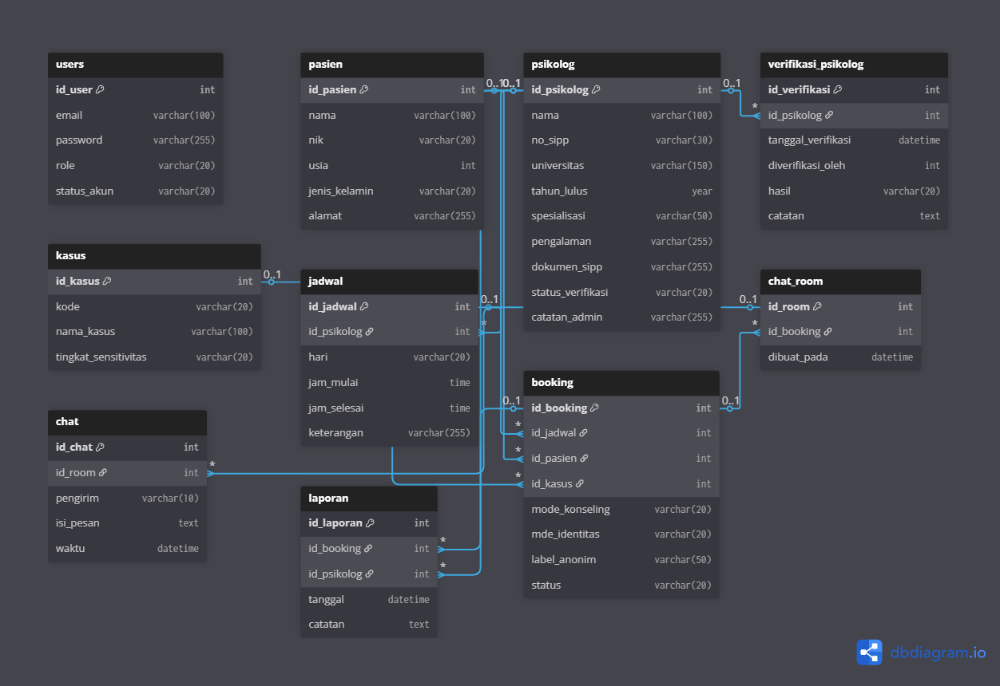

# 📌 Rancangan Database BK Ruang Pulih

Dokumen ini berisi rancangan struktur database yang digunakan dalam Website **BK Ruang Pulih**.  
Rancangan database dibuat untuk memastikan hubungan antar entitas konsisten, aman, dan mudah digunakan dalam proses pengembangan aplikasi.

---

## 🗂️ Diagram ERD (Entity Relationship Diagram)

Berikut merupakan visualisasi hubungan antar tabel:

---

## 🛢️ **Daftar Tabel dan Penjelasannya**

### 1. **users**
Menyimpan informasi login untuk semua jenis pengguna.
- `id_user` (int)
- `email` (varchar)
- `password` (varchar)
- `role` (varchar) — admin / psikolog / pasien
- `status_akun` (varchar)

---

### 2. **pasien**
Menyimpan informasi pasien yang melakukan konsultasi.
- `id_pasien` (int)
- `nama`
- `nik`
- `usia`
- `jenis_kelamin`
- `alamat`

---

### 3. **psikolog**
Detail psikolog yang tersedia.
- `id_psikolog`
- `nama`
- `no_sipp`
- `universitas`
- `tahun_lulus`
- `spesialisasi`
- `pengalaman`
- `dokumen_sipp`
- `status_verifikasi`
- `catatan_admin`

---

### 4. **verifikasi_psikolog**
Menampung riwayat verifikasi oleh admin.
- `id_verifikasi`
- `id_psikolog`
- `tanggal_verifikasi`
- `diverifikasi_oleh`
- `hasil`
- `catatan`

---

### 5. **jadwal**
Berisi jadwal konsultasi psikolog.
- `id_jadwal`
- `id_psikolog`
- `hari`
- `jam_mulai`
- `jam_selesai`
- `keterangan`

---

### 6. **booking**
Data pemesanan sesi konsultasi oleh pasien.
- `id_booking`
- `id_jadwal`
- `id_pasien`
- `id_kasus`
- `mode_konseling`
- `mode_identitas`
- `label_anonim`
- `status`

---

### 7. **kasus**
Jenis kasus yang dialami pasien.
- `id_kasus`
- `kode`
- `nama_kasus`
- `tingkat_sensitivitas`

---

### 8. **chat_room**
Ruang chat untuk tiap booking.
- `id_room`
- `id_booking`
- `dibuat_pada`

---

### 9. **chat**
Riwayat pesan yang dikirim oleh pasien/psikolog.
- `id_chat`
- `id_room`
- `pengirim`
- `isi_pesan`
- `waktu`

---

### 10. **laporan**
Laporan akhir dari psikolog setelah sesi.
- `id_laporan`
- `id_booking`
- `id_psikolog`
- `tanggal`
- `catatan`

---

## 🔗 **Relasi Database (Ringkasan)**

- 1 Psikolog ➝ banyak Jadwal  
- 1 Jadwal ➝ banyak Booking  
- 1 Pasien ➝ banyak Booking  
- 1 Booking ➝ 1 Chat Room  
- 1 Chat Room ➝ banyak Chat  
- 1 Booking ➝ banyak Laporan  
- 1 Psikolog ➝ banyak Laporan  
- 1 Psikolog ➝ banyak Verifikasi Riwayat  

---

---

# 🔄 Alur Fitur Website

Berikut gambaran alur fitur utama dalam aplikasi.

## **🔹 1. Registrasi & Login**
- User mendaftar sebagai pasien atau psikolog.
- Psikolog wajib upload dokumen SIPP untuk diverifikasi.
- Admin memverifikasi psikolog sebelum aktif.

## **🔹 2. Psikolog Mengatur Jadwal**
- Psikolog menambahkan jadwal konsultasi.
- Jadwal tampil di halaman pasien.

## **🔹 3. Pasien Melakukan Booking**
- Pasien memilih jadwal, kasus, serta mode konseling.
- Booking masuk ke status "Menunggu".

## **🔹 4. Admin/psikolog memproses booking**
- Booking berubah status: *disetujui / ditolak / selesai*.

## **🔹 5. Sistem Membuat Chat Room**
- Saat booking diterima, otomatis dibuat:
  - 1 chat_room untuk pasien ↔ psikolog
  - Pasien & psikolog bisa mulai chat

## **🔹 6. Sesi Konseling (Chat)**
- Chat realtime berbasis text
- Pesan disimpan di tabel `chat`

## **🔹 7. Psikolog Membuat Laporan**
- Setelah sesi selesai, psikolog mengisi laporan
- Laporan tersimpan di tabel `laporan`
- Pasien dapat melihat laporan akhir

## **🔹 8. Riwayat Konsultasi**
- Pasien dapat melihat riwayat booking, chat, laporan
- Psikolog bisa melihat riwayat pasien dan hasil konsultasi

---

